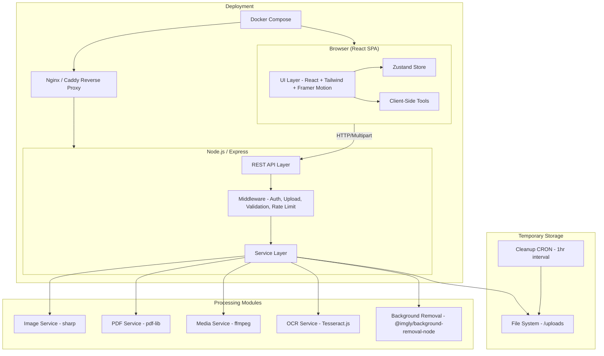
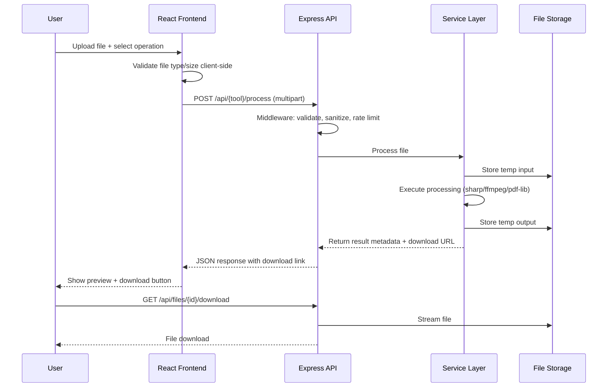

# Design Document: All-in-One Utility Hub

## Overview

The All-in-One Utility Hub is a full-stack web application providing 40+ browser-based utilities spanning image processing, document conversion, text manipulation, developer tools, academic tools, and more. The system follows a client-heavy architecture where most computations happen in the browser, with a Node.js/Express backend handling file-intensive operations (image conversion, PDF manipulation, media transcoding, OCR, background removal).

The frontend is a React SPA using Zustand for state management, Tailwind CSS for styling, and Framer Motion for animations. The backend exposes a RESTful API, processes files using sharp, ffmpeg, pdf-lib, and Tesseract.js, and stores temporary uploads that are purged within 24 hours.

### Key Design Decisions

| Decision | Choice | Rationale |
|---|---|---|
| Client vs Server processing | Hybrid | Text/color/calc tools run client-side for speed; file processing runs server-side |
| State management | Zustand | Lightweight, minimal boilerplate, works well with React |
| Styling | Tailwind CSS + Framer Motion | Utility-first CSS with smooth animations for CRED-inspired UI |
| Image processing | sharp | High-performance Node.js image processing, supports all required formats |
| PDF processing | pdf-lib | Pure JS PDF manipulation, no native dependencies |
| Media processing | ffmpeg (fluent-ffmpeg) | Industry standard for audio/video conversion |
| OCR | Tesseract.js | Client/server flexible, supports 100+ languages |
| Testing | Vitest + RTL + Playwright + fast-check | Comprehensive unit, integration, property-based, and E2E testing |
| Deployment | Docker Compose + Nginx/Caddy | Single-command deployment, reverse proxy for HTTPS |

## Architecture

### High-Level Architecture



### Client-Side vs Server-Side Processing

```mermaid
graph LR
    subgraph ClientSide["Client-Side (No Server)"]
        T1[Text Utilities]
        T2[Color Tools]
        T3[Unit Converter]
        T4[Password Generator]
        T5[Scientific Calculator]
        T6[GPA Calculator]
        T7[Academic Text Metrics]
        T8[Pomodoro Timer]
        T9[Flashcards]
        T10[Checksum Calculator]
        T11[LaTeX Renderer]
        T12[Markdown Editor]
        T13[Developer Tools - JSON/YAML/XML]
        T14[Citation Generator]
        T15[Essay Outline Generator]
        T16[Text Summarizer - extractive]
    end

    subgraph ServerSide["Server-Side (File Processing)"]
        S1[Image Conversion/Compression/Resize]
        S2[PDF Operations]
        S3[Document Conversion]
        S4[Media Conversion]
        S5[OCR]
        S6[Background Removal]
        S7[Favicon Generation]
        S8[GIF Maker]
        S9[QR/Barcode Generation]
        S10[SEO Analysis - URL fetch]
        S11[Meme Generator]
        S12[E-Signature on PDF]
        S13[Image Editing]
    end
```



### Request Flow



## Components and Interfaces

### Frontend Components

```
src/
├── components/
│   ├── layout/
│   │   ├── AppShell.jsx          # Main layout wrapper
│   │   ├── Navbar.jsx            # Top navigation bar
│   │   ├── Sidebar.jsx           # Category sidebar (desktop)
│   │   ├── MobileMenu.jsx        # Hamburger menu (mobile)
│   │   └── Footer.jsx
│   ├── common/
│   │   ├── FileUpload.jsx        # Drag-and-drop file upload zone
│   │   ├── BatchUpload.jsx       # Multi-file upload with progress
│   │   ├── ProgressBar.jsx       # Processing progress indicator
│   │   ├── ErrorMessage.jsx      # Error display component
│   │   ├── DownloadButton.jsx    # File download with countdown
│   │   ├── PreviewPanel.jsx      # Side-by-side before/after preview
│   │   ├── ThemeToggle.jsx       # Dark/light theme switch
│   │   └── SearchBar.jsx         # Global tool search
│   ├── tools/
│   │   ├── image/                # Image tools (convert, compress, resize, edit, bg-remove)
│   │   ├── pdf/                  # PDF tools (merge, split, compress, sign, etc.)
│   │   ├── document/             # Document conversion tools
│   │   ├── text/                 # Text utilities, markdown editor, summarizer
│   │   ├── developer/            # JSON/YAML/XML, JWT, regex, cron, etc.
│   │   ├── media/                # Audio/video conversion, GIF maker
│   │   ├── ai/                   # AI content detection
│   │   ├── student/              # GPA calc, flashcards, timer, LaTeX, citations, essay outline
│   │   ├── design/               # Color tools, meme generator, favicon
│   │   ├── security/             # Password generator, checksum
│   │   ├── seo/                  # SEO analyzer
│   │   └── utility/              # Unit converter, QR codes
│   └── pages/
│       ├── HomePage.jsx          # Landing page with categories
│       ├── ToolPage.jsx          # Generic tool page wrapper
│       ├── CategoryPage.jsx      # Category listing page
│       └── NotFoundPage.jsx
├── stores/
│   ├── useToolStore.js           # Tool registry and search state
│   ├── useFileStore.js           # File upload and processing state
│   ├── useThemeStore.js          # Theme preferences
│   └── useHistoryStore.js        # Recently used tools
├── hooks/
│   ├── useFileUpload.js          # File upload logic
│   ├── useClientProcess.js       # Client-side processing wrapper
│   └── useServerProcess.js       # Server-side API call wrapper
├── utils/
│   ├── textUtils.js              # Case conversion, word count, hashing, encoding
│   ├── colorUtils.js             # Color conversion, palette generation, contrast
│   ├── unitConverter.js          # Unit and currency conversion
│   ├── passwordGenerator.js      # Password/passphrase generation
│   ├── scientificCalc.js         # Calculator engine
│   ├── gpaCalculator.js          # GPA calculation logic
│   ├── academicMetrics.js        # Text metrics, readability scores
│   ├── citationFormatter.js      # Citation formatting for APA/MLA/Chicago/Harvard
│   ├── flashcardParser.js        # CSV import/export, delimiter parsing
│   ├── dataTransform.js          # JSON/CSV/YAML/XML conversions
│   ├── textSummarizer.js         # Extractive summarization
│   ├── pomodoroTimer.js          # Timer logic
│   ├── checksumWorker.js         # Web Worker for client-side checksums
│   ├── essayOutline.js           # Essay outline generation
│   └── validators.js             # Input validation helpers
├── lib/
│   ├── api.js                    # Axios/fetch API client
│   └── toolRegistry.js           # Tool metadata, categories, search index
├── App.jsx
└── main.jsx
```

### Backend Components

```
server/
├── index.js                      # Express app entry point
├── config/
│   └── index.js                  # Environment variable config
├── middleware/
│   ├── upload.js                 # Multer file upload config
│   ├── validate.js               # Request validation
│   ├── sanitize.js               # File sanitization
│   ├── rateLimit.js              # Rate limiting
│   └── errorHandler.js           # Global error handler
├── routes/
│   ├── image.js                  # /api/image/* routes
│   ├── pdf.js                    # /api/pdf/* routes
│   ├── document.js               # /api/document/* routes
│   ├── media.js                  # /api/media/* routes
│   ├── ocr.js                    # /api/ocr/* routes
│   ├── qr.js                     # /api/qr/* routes
│   ├── seo.js                    # /api/seo/* routes
│   ├── meme.js                   # /api/meme/* routes
│   ├── favicon.js                # /api/favicon/* routes
│   ├── gif.js                    # /api/gif/* routes
│   ├── signature.js              # /api/signature/* routes
│   └── files.js                  # /api/files/* download routes
├── services/
│   ├── imageService.js           # sharp-based image processing
│   ├── pdfService.js             # pdf-lib PDF operations
│   ├── documentService.js        # Document format conversion
│   ├── mediaService.js           # ffmpeg audio/video conversion
│   ├── ocrService.js             # Tesseract.js OCR
│   ├── backgroundRemoval.js      # AI background removal
│   ├── qrService.js              # QR/barcode generation and reading
│   ├── seoService.js             # URL fetching and SEO analysis
│   ├── memeService.js            # Meme template rendering
│   ├── faviconService.js         # Favicon set generation
│   ├── gifService.js             # GIF creation from images/video
│   ├── signatureService.js       # PDF signature embedding
│   └── cleanupService.js         # Scheduled file cleanup
├── utils/
│   ├── fileHelpers.js            # File path, naming, temp management
│   └── errors.js                 # Custom error classes
└── uploads/                      # Temporary file storage (auto-purged)
```

### API Interface

| Method | Endpoint | Description |
|---|---|---|
| POST | `/api/image/convert` | Convert image format |
| POST | `/api/image/compress` | Compress image |
| POST | `/api/image/resize` | Resize image |
| POST | `/api/image/edit` | Crop, rotate, flip, watermark |
| POST | `/api/image/remove-bg` | Remove background |
| POST | `/api/pdf/convert` | Convert to/from PDF |
| POST | `/api/pdf/merge` | Merge multiple PDFs |
| POST | `/api/pdf/split` | Split PDF by page ranges |
| POST | `/api/pdf/compress` | Compress PDF |
| POST | `/api/pdf/protect` | Add/remove password |
| POST | `/api/pdf/reorder` | Reorder pages |
| POST | `/api/pdf/rotate` | Rotate pages |
| POST | `/api/pdf/watermark` | Add watermark |
| POST | `/api/pdf/pages` | Add/delete/extract pages |
| POST | `/api/document/convert` | Convert document formats |
| POST | `/api/media/convert-audio` | Convert audio format |
| POST | `/api/media/convert-video` | Convert video format |
| POST | `/api/ocr/extract` | Extract text from image/PDF |
| POST | `/api/qr/generate` | Generate QR code |
| POST | `/api/qr/decode` | Decode QR/barcode from image |
| POST | `/api/qr/barcode` | Generate barcode |
| POST | `/api/seo/analyze` | Analyze URL for SEO |
| POST | `/api/meme/generate` | Generate meme image |
| GET  | `/api/meme/templates` | List meme templates |
| POST | `/api/favicon/generate` | Generate favicon set |
| POST | `/api/gif/create` | Create GIF from images/video |
| POST | `/api/signature/sign` | Add signature to PDF |
| GET  | `/api/files/:id/download` | Download processed file |
| DELETE | `/api/files/:id` | Manually delete file |

### Key Interfaces

```typescript
// File processing request/response pattern
interface ProcessRequest {
  files: File[];              // Uploaded files
  options: Record<string, any>; // Tool-specific options
}

interface ProcessResponse {
  success: boolean;
  fileId: string;             // Unique ID for download
  downloadUrl: string;        // /api/files/{id}/download
  metadata: {
    originalName: string;
    outputName: string;
    originalSize: number;
    outputSize: number;
    mimeType: string;
    expiresAt: string;        // ISO timestamp (24hr from now)
  };
  preview?: string;           // Base64 preview for images
}

// Tool registry entry
interface ToolDefinition {
  id: string;                 // e.g. "image-convert"
  name: string;               // e.g. "Image Format Converter"
  description: string;
  category: ToolCategory;
  keywords: string[];
  path: string;               // Route path
  icon: string;               // Icon component name
  isClientSide: boolean;      // Whether tool runs in browser
  maxFileSize?: number;       // Override default 100MB
  maxBatchSize?: number;      // Max files in batch
  supportedFormats?: string[];
}

type ToolCategory = 'image' | 'document' | 'text' | 'developer' | 'media' | 'ai' | 'student' | 'design' | 'security' | 'seo' | 'utility';

// Zustand store interfaces
interface FileStore {
  files: UploadedFile[];
  processing: boolean;
  progress: number;
  error: string | null;
  addFiles: (files: File[]) => void;
  removeFile: (id: string) => void;
  clearFiles: () => void;
  setProcessing: (status: boolean) => void;
  setProgress: (value: number) => void;
  setError: (error: string | null) => void;
}

interface ToolStore {
  tools: ToolDefinition[];
  searchQuery: string;
  activeCategory: ToolCategory | null;
  recentTools: string[];      // Tool IDs from localStorage
  setSearchQuery: (query: string) => void;
  setActiveCategory: (category: ToolCategory | null) => void;
  addRecentTool: (toolId: string) => void;
  getFilteredTools: () => ToolDefinition[];
}
```


## Data Models

### File Metadata (Server-Side)

```javascript
// Stored in-memory or lightweight DB (SQLite/LowDB) for temp file tracking
const fileRecord = {
  id: "uuid-v4",                    // Unique file identifier
  originalName: "photo.png",        // Original upload filename
  outputName: "photo-converted.jpg",// Processed output filename
  inputPath: "/uploads/input/...",  // Path to uploaded file
  outputPath: "/uploads/output/...",// Path to processed file
  mimeType: "image/jpeg",
  originalSize: 2048000,            // bytes
  outputSize: 512000,               // bytes
  tool: "image-convert",            // Which tool processed it
  options: {},                      // Processing options used
  createdAt: "2024-01-01T00:00:00Z",
  expiresAt: "2024-01-02T00:00:00Z",// 24 hours after creation
  sessionId: "session-uuid",        // For user isolation
  status: "completed"               // pending | processing | completed | failed
};
```

### Tool Registry (Client-Side)

```javascript
// Tool metadata used for search, navigation, and rendering
const toolEntry = {
  id: "image-convert",
  name: "Image Format Converter",
  description: "Convert images between PNG, JPG, WEBP, SVG, GIF, BMP, TIFF, ICO, and AVIF",
  category: "image",
  keywords: ["convert", "png", "jpg", "webp", "svg", "gif", "format", "image"],
  path: "/tools/image/convert",
  icon: "ImageIcon",
  isClientSide: false,
  maxFileSize: 104857600,       // 100MB
  maxBatchSize: 20,
  supportedFormats: ["png", "jpg", "jpeg", "webp", "svg", "gif", "bmp", "tiff", "ico", "avif"]
};
```

### Client-Side Storage Models (localStorage)

```javascript
// Recently used tools
const recentTools = ["image-convert", "pdf-merge", "json-formatter"]; // max 10

// Theme preference
const themePreference = { mode: "dark" }; // "dark" | "light" | "system"

// GPA Calculator courses
const gpaCourses = {
  semesters: [
    {
      name: "Fall 2024",
      courses: [
        { name: "Calculus I", credits: 4, grade: "A" },
        { name: "English 101", credits: 3, grade: "B+" }
      ]
    }
  ],
  customScale: null // or { "A": 4.0, "A-": 3.7, ... }
};

// Flashcard sets
const flashcardSets = [
  {
    id: "uuid",
    name: "Biology Chapter 5",
    cards: [
      { front: "Mitochondria", back: "Powerhouse of the cell" }
    ],
    createdAt: "2024-01-01T00:00:00Z"
  }
];

// Pomodoro session history
const pomodoroHistory = {
  sessions: [
    { date: "2024-01-01", workSessions: 4, totalMinutes: 100 }
  ]
};

// E-Signature (stored for reuse)
const savedSignature = {
  type: "draw",           // "draw" | "type" | "upload"
  data: "base64-string",  // Canvas data URL or image
  fontFamily: null         // For typed signatures
};

// Citation bibliography
const bibliography = {
  style: "apa7",
  citations: [
    {
      id: "uuid",
      sourceType: "journal",
      fields: { title: "...", author: "...", year: "2024", journal: "...", volume: "1", pages: "1-10", doi: "..." },
      formatted: { apa7: "...", mla9: "...", chicago17: "...", harvard: "..." }
    }
  ]
};
```

### Data Transformation Models (Client-Side)

```javascript
// JSON/CSV/YAML/XML conversion - intermediate representation
// All conversions go through a normalized JS object as intermediate format
// JSON <-> JS Object <-> CSV/YAML/XML

// CSV parsing config
const csvConfig = {
  delimiter: ",",
  hasHeader: true,
  quoteChar: '"'
};

// Color model
const color = {
  hex: "#FF5733",
  rgb: { r: 255, g: 87, b: 51 },
  hsl: { h: 11, s: 100, l: 60 },
  hsv: { h: 11, s: 80, v: 100 },
  cmyk: { c: 0, m: 66, y: 80, k: 0 }
};

// Password generation config
const passwordConfig = {
  length: 16,
  uppercase: true,
  lowercase: true,
  numbers: true,
  special: true,
  excludeAmbiguous: false,  // exclude 0, O, l, 1, etc.
  mode: "password"          // "password" | "passphrase"
  // passphrase options
  wordCount: 4,
  separator: "-"
};

// Academic text metrics result
const textMetrics = {
  wordCount: 1500,
  charCount: 8200,
  sentenceCount: 75,
  paragraphCount: 12,
  pagesDoubleSpaced: 6.0,
  pagesSingleSpaced: 3.0,
  speakingTimeMinutes: 11.5,
  readability: {
    fleschKincaid: 10.2,
    fleschReadingEase: 55.0,
    gunningFog: 12.1,
    colemanLiau: 11.5,
    level: "College"
  }
};

// GPA calculation
const gpaResult = {
  semesterGPA: 3.45,
  cumulativeGPA: 3.62,
  totalCredits: 30,
  totalQualityPoints: 108.6
};

// Scientific calculator expression
const calcExpression = {
  input: "sin(pi/4) + log(100)",
  result: 2.7071067811865475,
  history: [
    { expression: "2 + 3", result: 5 },
    { expression: "sqrt(144)", result: 12 }
  ],
  mode: "radians"  // "radians" | "degrees"
};
```


## Correctness Properties

*A property is a characteristic or behavior that should hold true across all valid executions of a system — essentially, a formal statement about what the system should do. Properties serve as the bridge between human-readable specifications and machine-verifiable correctness guarantees.*

### Property 1: Image format conversion produces valid output

*For any* valid image in a supported format and *for any* target format from the set {PNG, JPG, WEBP, SVG, GIF, BMP, TIFF, ICO, AVIF}, converting the image to the target format should produce a non-empty file that is a valid file in the target format.

**Validates: Requirements 1.1, 1.2**

### Property 2: Image metadata preservation

*For any* image containing EXIF metadata, converting the image to a metadata-supporting target format with the "preserve metadata" option enabled should produce an output image that contains the same EXIF fields as the original.

**Validates: Requirements 1.4**

### Property 3: Invalid file rejection

*For any* file that is not a valid image (for image tools) or not a valid document (for document tools), submitting it for processing should return an error response with a descriptive message and a non-2xx status code, leaving the system state unchanged.

**Validates: Requirements 1.3, 5.3**

### Property 4: Batch processing size limits

*For any* image processing tool that supports batch operations, submitting a batch of N files where 1 ≤ N ≤ 20 should process all files successfully, and submitting a batch where N > 20 should be rejected with an error.

**Validates: Requirements 1.5, 2.4, 3.4**

### Property 5: Compression reduces or maintains file size

*For any* valid image and *for any* lossy compression quality level in [1, 100], compressing the image should produce an output whose file size is less than or equal to the original file size, and the response should include both the original and compressed sizes.

**Validates: Requirements 2.1, 2.3**

### Property 6: Lossless compression preserves pixel data

*For any* valid image, compressing it in lossless mode should produce an output image that is pixel-identical to the original when decoded.

**Validates: Requirements 2.2**

### Property 7: Image resize matches specification

*For any* valid image and *for any* resize specification (either pixel dimensions {w, h} or a percentage scale factor), the output image dimensions should exactly match the specified target. For percentage-based resizing, the output dimensions should equal floor(original × percentage / 100).

**Validates: Requirements 3.1, 3.5**

### Property 8: Aspect ratio preservation during resize

*For any* valid image with aspect ratio W:H, resizing with the "maintain aspect ratio" option and specifying only a target width should produce an output whose height preserves the original aspect ratio (within ±1 pixel rounding tolerance).

**Validates: Requirements 3.2**

### Property 9: PDF merge preserves total page count

*For any* list of valid PDF files, merging them should produce a single PDF whose page count equals the sum of all input PDF page counts.

**Validates: Requirements 4.2**

### Property 10: PDF split preserves specified pages

*For any* valid PDF with N pages and *for any* valid set of non-overlapping page ranges that cover a subset of [1, N], splitting the PDF should produce separate files whose combined page count equals the total number of pages specified in the ranges.

**Validates: Requirements 4.3**

### Property 11: PDF compression produces valid smaller output

*For any* valid PDF, compressing it should produce a valid PDF with a file size less than or equal to the original, and the response should include both sizes.

**Validates: Requirements 4.4**

### Property 12: PDF password protection round-trip

*For any* valid unprotected PDF and *for any* non-empty password string, adding password protection and then removing it with the same password should produce a PDF with the same page count and content as the original.

**Validates: Requirements 4.6, 4.7**

### Property 13: PDF page reorder preserves page count

*For any* valid PDF with N pages and *for any* permutation of [1..N], reordering the pages should produce a PDF with exactly N pages.

**Validates: Requirements 4.8**

### Property 14: PDF rotation by 360° is identity

*For any* valid PDF and *for any* page in that PDF, rotating the page by 90° four times (totaling 360°) should produce a page with the same dimensions as the original.

**Validates: Requirements 4.9**

### Property 15: PDF watermark preserves page count

*For any* valid PDF with N pages and *for any* watermark configuration (text or image, any opacity, any position), applying the watermark should produce a valid PDF with exactly N pages.

**Validates: Requirements 4.10**

### Property 16: PDF page add/delete count invariant

*For any* valid PDF with N pages: adding a page should produce a PDF with N+1 pages, deleting a page should produce a PDF with N-1 pages (when N > 1), and extracting a page should produce a single-page PDF.

**Validates: Requirements 4.11**

### Property 17: Document format conversion

*For any* valid document in a supported format and *for any* target format from {Markdown, HTML, plain text, CSV, XLSX}, conversion should produce a non-empty file in the target format.

**Validates: Requirements 5.1, 5.2**

### Property 18: Document structure round-trip preservation

*For any* Markdown document, converting to HTML and back to Markdown should preserve the structural elements (headings, lists, links, emphasis) of the original document.

**Validates: Requirements 5.4**

### Property 19: File cleanup after expiry

*For any* file record with a creation timestamp older than 24 hours, running the cleanup service should result in the file being absent from storage and its metadata being absent from the database.

**Validates: Requirements 15.1**

### Property 20: File deletion completeness

*For any* file (whether deleted by the cleanup service or manually by the user), after deletion both the physical file on disk and all associated metadata records should be removed.

**Validates: Requirements 15.3, 15.5**

### Property 21: Expiry countdown calculation

*For any* file record with a known creation timestamp, the displayed remaining time should equal 24 hours minus the elapsed time since creation (within ±1 second tolerance).

**Validates: Requirements 15.4**

### Property 22: Session isolation

*For any* two distinct session IDs and *for any* file uploaded under session A, attempting to access that file using session B should return a 403/404 error.

**Validates: Requirements 16.3**

### Property 23: File size limit enforcement

*For any* file whose size exceeds the configured maximum (default 100 MB), the upload should be rejected with an error response that includes the size limit in the message.

**Validates: Requirements 16.7, 16.8**

### Property 24: Tool search returns matching results

*For any* search query string, every tool returned by the search function should have the query matching (case-insensitive substring) against at least one of: the tool name, description, or keywords.

**Validates: Requirements 17.1**

### Property 25: All tools belong to valid categories

*For any* tool in the tool registry, its category should be one of the defined set: {Image, Document, Text, Developer, Media, AI, Student, Utilities}.

**Validates: Requirements 17.2**

### Property 26: Recent tools tracking

*For any* tool that a user interacts with, that tool's ID should appear in the recent tools list, and the list should maintain a maximum of 10 entries in most-recently-used order.

**Validates: Requirements 17.3**

### Property 27: Related tools share category

*For any* tool, all suggested related tools should belong to the same category as the current tool.

**Validates: Requirements 17.4**

### Property 28: Failed operations return descriptive errors

*For any* file processing operation that fails (due to invalid input, processing error, or server issue), the response should contain a non-empty error message string and a non-2xx HTTP status code.

**Validates: Requirements 19.3**

### Property 29: Batch concurrency limit

*For any* batch processing operation with a configured concurrency limit of C, at no point during processing should more than C files be processed simultaneously.

**Validates: Requirements 19.5**


## Error Handling

### Error Classification

The system uses a layered error handling strategy with errors classified by origin and severity:

| Error Type | HTTP Status | Handling Layer | Example |
|---|---|---|---|
| Validation Error | 400 | Middleware | Invalid file type, missing parameters, size exceeded |
| File Not Found | 404 | Route Handler | Download link expired or invalid file ID |
| Session Forbidden | 403 | Middleware | Accessing another session's file |
| Processing Error | 422 | Service Layer | Corrupted file, unsupported conversion pair |
| Rate Limit | 429 | Middleware | Too many requests from same IP |
| Server Error | 500 | Global Handler | Unexpected crashes, out-of-memory |

### Error Response Format

All API errors return a consistent JSON structure:

```json
{
  "success": false,
  "error": {
    "code": "INVALID_FILE_TYPE",
    "message": "Unsupported file type. Supported formats: PNG, JPG, WEBP, SVG, GIF, BMP, TIFF, ICO, AVIF",
    "details": {
      "received": "application/pdf",
      "supported": ["image/png", "image/jpeg", "image/webp"]
    }
  }
}
```

### Error Codes

```javascript
const ErrorCodes = {
  // Validation
  INVALID_FILE_TYPE: 'Uploaded file type is not supported for this tool',
  FILE_TOO_LARGE: 'File exceeds the maximum allowed size',
  BATCH_LIMIT_EXCEEDED: 'Batch exceeds the maximum number of files',
  MISSING_PARAMETER: 'Required parameter is missing',
  INVALID_PARAMETER: 'Parameter value is out of valid range',

  // Processing
  PROCESSING_FAILED: 'File processing failed',
  CONVERSION_UNSUPPORTED: 'Conversion between these formats is not supported',
  CORRUPTED_FILE: 'File appears to be corrupted or unreadable',
  PASSWORD_INCORRECT: 'Incorrect password for protected PDF',

  // Access
  FILE_NOT_FOUND: 'File not found or has expired',
  SESSION_FORBIDDEN: 'Access denied to this resource',
  RATE_LIMITED: 'Too many requests, please try again later',

  // Server
  INTERNAL_ERROR: 'An unexpected error occurred'
};
```

### Client-Side Error Handling

```
User Action → Client Validation → API Call → Response Check → UI Feedback
     │              │                              │
     │         Show inline          ┌──────────────┤
     │         error immediately    │              │
     │                          Success         Error
     │                          Show result     Show error + retry button
     │
     └── File type check (extension + MIME)
     └── File size check (before upload)
     └── Required fields check
```

- Client-side validation runs before any API call to provide instant feedback
- File type and size are checked in the browser before upload begins
- All processing errors show a retry button so users can attempt the operation again
- Network errors trigger an automatic retry with exponential backoff (max 3 retries)
- Client-side tools (text, color, calculator) use try/catch with user-friendly error messages displayed inline

### Server-Side Error Handling

- Express global error handler catches all unhandled errors and returns the standard error JSON
- Each service wraps processing in try/catch and throws typed errors (e.g., `ValidationError`, `ProcessingError`)
- File cleanup runs in a finally block to ensure temp files are removed even on failure
- The cleanup CRON job has its own error handling to prevent a single file deletion failure from stopping the entire sweep
- All errors are logged with request ID, timestamp, and stack trace for debugging

### Graceful Degradation

- If the server is unreachable, client-side tools continue to function normally
- If a batch operation partially fails, successfully processed files are still returned with a summary of which files failed and why
- If the cleanup service encounters a locked file, it skips it and retries on the next cycle

## Testing Strategy

### Testing Stack

| Layer | Tool | Purpose |
|---|---|---|
| Unit Tests | Vitest | Pure functions, utilities, service logic |
| Component Tests | Vitest + React Testing Library | React component rendering and interaction |
| Property Tests | Vitest + fast-check | Universal properties across generated inputs |
| E2E Tests | Playwright | Full user workflows across browsers |

### Property-Based Testing Configuration

- Library: **fast-check** (JavaScript property-based testing library)
- Minimum iterations: **100 per property test**
- Each property test must reference its design document property with a comment tag
- Tag format: `// Feature: all-in-one-utility-hub, Property {number}: {property_text}`
- Each correctness property from the design document is implemented by a single property-based test

### Unit Testing Scope

Unit tests cover specific examples, edge cases, and error conditions:

- Image service: specific format conversions (PNG→JPG, SVG→PNG), edge cases (1x1 pixel image, max dimensions)
- PDF service: merge 2 PDFs, split at specific pages, password with special characters
- Document service: Markdown with complex nested lists, CSV with quoted commas, empty files
- Cleanup service: file exactly at 24h boundary, file with missing metadata
- Tool search: empty query returns all, special characters in query, single-character query
- File validation: exactly 100MB file (boundary), 0-byte file, file with spoofed MIME type

### Property-Based Testing Scope

Property tests validate the 29 correctness properties defined above. Key test generators:

- **Image generator**: Produces random valid images (1-4000px dimensions, random pixel data, random formats)
- **PDF generator**: Produces random valid PDFs (1-50 pages, random text content)
- **Document generator**: Produces random Markdown/HTML/CSV/text documents with varied structure
- **Tool registry generator**: Produces random tool definitions with valid categories and keywords
- **Session ID generator**: Produces random UUIDs for session isolation tests
- **File size generator**: Produces file sizes around the 100MB boundary for limit testing

### E2E Testing Scope (Playwright)

E2E tests cover critical user workflows:

- Upload image → convert → download (happy path)
- Upload PDF → merge multiple → download
- Search for a tool → navigate → use tool
- Mobile viewport: hamburger menu, touch upload, responsive layout
- Accessibility: keyboard navigation through tool discovery, screen reader landmarks
- Cross-browser: Chrome, Firefox, Safari (via Playwright browser configs)

### Test Organization

```
tests/
├── unit/
│   ├── services/
│   │   ├── imageService.test.js
│   │   ├── pdfService.test.js
│   │   ├── documentService.test.js
│   │   └── cleanupService.test.js
│   ├── utils/
│   │   ├── validators.test.js
│   │   ├── textUtils.test.js
│   │   └── colorUtils.test.js
│   └── stores/
│       ├── useToolStore.test.js
│       └── useFileStore.test.js
├── property/
│   ├── imageConversion.prop.test.js
│   ├── pdfOperations.prop.test.js
│   ├── documentConversion.prop.test.js
│   ├── fileCleanup.prop.test.js
│   ├── security.prop.test.js
│   ├── toolDiscovery.prop.test.js
│   └── batchProcessing.prop.test.js
├── component/
│   ├── FileUpload.test.jsx
│   ├── SearchBar.test.jsx
│   ├── ToolPage.test.jsx
│   └── PreviewPanel.test.jsx
└── e2e/
    ├── imageWorkflow.spec.js
    ├── pdfWorkflow.spec.js
    ├── toolDiscovery.spec.js
    ├── mobileExperience.spec.js
    └── accessibility.spec.js
```

### Coverage Targets

- Unit + Property tests: ≥ 80% line coverage on service and utility modules
- Component tests: All shared components (FileUpload, SearchBar, ErrorMessage, DownloadButton)
- E2E tests: All critical user workflows for Batch 1 tools (image, PDF, document, tool discovery)
